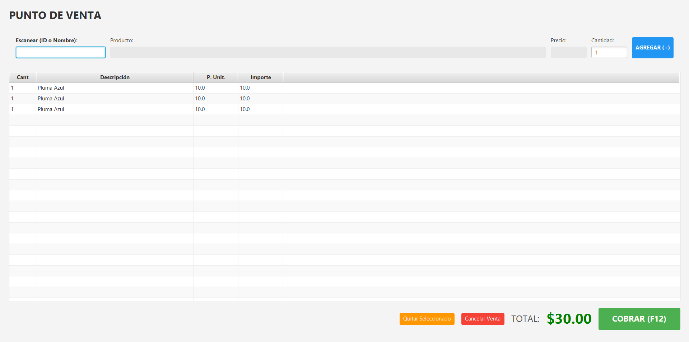
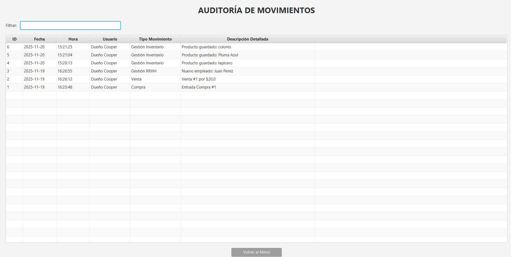
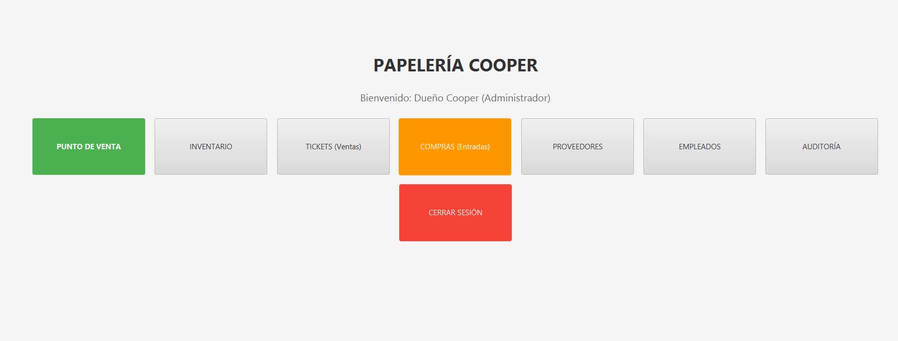

# Sistema POS & Gestión de Inventario (Desktop) 🖊️📒

> **Proyecto:** Aplicación de Escritorio para la administración integral de "Papelería Cooper".
> **Rol:** Desarrollador Único (Full Lifecycle Development).

## 📖 Descripción Técnica
Proyecto individual desarrollado para resolver las necesidades de un punto de venta físico. A diferencia de mis proyectos web, esta solución de escritorio fue construida íntegramente en **Java** para optimizar recursos locales.

Fui responsable de todo el ciclo de vida del software: desde el levantamiento de requerimientos con el cliente hasta el diseño de la base de datos y la programación de la interfaz gráfica.

---

## 💻 Módulos Desarrollados

### 1. Punto de Venta (POS)
Interfaz optimizada para teclados (Hotkeys). Implementé la lógica de cálculo de precios, impuestos y cambio en tiempo real.

### 2. Módulo de Seguridad y Auditoría
Diseñé un sistema de logs inmutables que registra cada movimiento sensible (quién borró un producto, quién editó un precio), proporcionando seguridad al dueño del negocio.

### 3. Gestión Administrativa
CRUDs completos para el manejo de inventario, proveedores y empleados, conectados a una base de datos MySQL local.

---

## ⚙️ Arquitectura
* **Patrón MVC:** Separación estricta entre la lógica de negocio y la interfaz JavaFX.
* **Maven:** Gestión de dependencias automatizada.
* **MySQL:** Base de datos relacional para asegurar la integridad transaccional.

---

### 📬 Contacto

