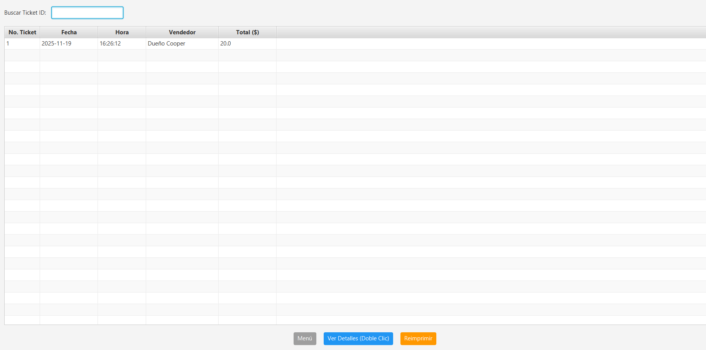
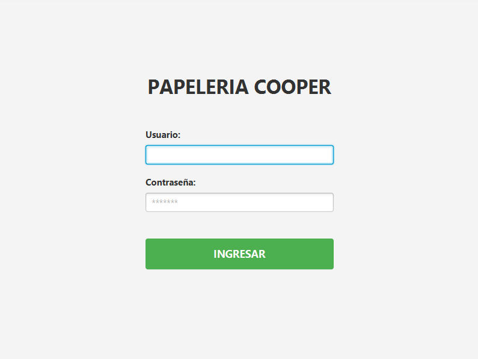

# Sistema POS & Gestión de Inventario (Desktop) 🖊️📒

> **Proyecto:** Aplicación de Escritorio para la administración integral de "Papelería Cooper".
> **Stack:** Java SE, JavaFX UI, MySQL (XAMPP), Maven Dependency Management.

## 📖 Descripción Técnica
Este sistema fue desarrollado para resolver las necesidades de un punto de venta físico con alto tráfico. A diferencia de una web app, esta solución de escritorio optimiza el uso de recursos locales y garantiza la operatividad sin dependencia de internet.

El objetivo fue crear un **ERP Ligero** que controlara no solo el flujo de efectivo, sino también la seguridad operativa mediante un **Módulo de Auditoría** que registra cada movimiento sensible en la base de datos.

---

## 💻 Módulos Principales

### 1. Punto de Venta (POS) Optimizado
Interfaz diseñada para la velocidad. Permite a los cajeros procesar ventas rápidamente utilizando **Atajos de Teclado (F12 para cobrar)**, escaneo de IDs y cálculo automático de cambio.

### 2. Seguridad y Auditoría (Trazabilidad) 🛡️
Una de las características más robustas del sistema. Cada acción crítica (login, venta, alta de inventario, modificación de empleado) queda registrada en un log inmutable.
* **¿Qué resuelve?** Permite al dueño rastrear errores o robos hormiga, sabiendo exactamente qué usuario realizó la acción y el *timestamp* preciso.

| Dashboard General | Bitácora de Auditoría |
|:---:|:---:|
|  |  |

---

## 📊 Gestión Administrativa

El sistema centraliza la operación del negocio permitiendo un control granular sobre los recursos humanos y el stock.

* **Control de Tickets:** Historial completo de transacciones para cortes de caja y devoluciones.
* **Gestión de Empleados:** Sistema CRUD con asignación de roles (Administrador vs Vendedor) y credenciales de acceso seguras.

| Historial de Ventas | Gestión de Roles |
|:---:|:---:|
|  |  |

---

## ⚙️ Arquitectura y Herramientas

* **Patrón de Diseño:** MVC (Modelo-Vista-Controlador) para separar la lógica de negocio de la interfaz gráfica JavaFX.
* **Gestión de Dependencias:** Uso de **Apache Maven** para manejar librerías de conexión a base de datos y utilerías PDF.
* **Persistencia:** Conexión a base de datos relacional **MySQL/MariaDB** (implementada vía XAMPP) para asegurar la integridad de los datos transaccionales (ACID).
* **Seguridad:** Autenticación de usuarios mediante validación contra base de datos.

---

### 🚀 Instalación y Despliegue
El proyecto incluye un script SQL para la generación de la estructura de base de datos y datos semilla (seeders) para pruebas.
Requiere **Java JDK 17+** y un servidor MySQL activo.

### 📬 Contacto

